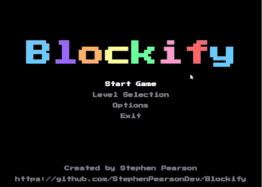

# Blockify

**Blockify** is a Java-based puzzle game inspired by the classic game of Tetris. This project is very much a work in progress (WIP), and while it is currently in a playable state, there is a lot of refactoring and feature enhancements needed. This is an old project that I am updating, and it serves as a learning tool for improving game development techniques in Java.

### 🎥 Gameplay Demo




### ⚠️ Disclaimer
- **No Copyright Infringement Intended**: This project is **not affiliated with or endorsed by the creators or copyright holders of Tetris**. Blockify is an original project inspired by the gameplay mechanics of Tetris but does not intend to replicate or infringe upon any copyrighted material.

### 🎮 Features
- Classic block-falling puzzle gameplay
- Multiple levels with increasing difficulty
- Various gameplay modes, including options and level selection
- Screen shake effects, ghost piece toggle, and flashing line clearing animations
- Retro-inspired fonts and color schemes
- Basic menu navigation and controls

### 🖥️ Running Locally

#### Prerequisites:
- Java JDK 8 or above
- [Maven](https://maven.apache.org/download.cgi) (if you want to build using Maven)

#### Running the Project

1. Clone the repository:
    ```bash
    git clone https://github.com/StephenPearsonDev/Blockify.git
    cd Blockify
    ```

2. If you use **Maven** to manage dependencies and build the project, run:
    ```bash
    mvn clean install
    ```

   Otherwise, you can compile the project using the `javac` command:
    ```bash
    javac -d target src/main/java/dev/stephenpearson/blockify/main/*.java
    ```

3. Run the game:
    ```bash
    java -cp target dev.stephenpearson.blockify.main.Main
    ```

### 🎮 Controls

- **Up Arrow**: Rotate current piece
- **Down Arrow**: Move piece down
- **Left/Right Arrow**: Move piece left/right
- **Spacebar**: Drop the piece instantly
- **K**: Change colors
- **G**: Toggle ghost piece (enabling/disabling shows where the piece will land)
- **ESC**: Pause the game or go back to the menu
- **Enter**: Select menu option or restart the game after game over

### 🛠️ Current State
- **Playable**: The game is functional and offers a basic Tetris-like experience.
- **Needs Refactoring**: Many areas of the code, such as rendering and game logic, need significant improvement and refactoring.
- **WIP**: This is a work in progress, and features like audio settings, advanced game modes, and control customization are still under development.

Feel free to fork the project or submit pull requests with improvements or new features! 😊

### 📝 License
This project is licensed under the MIT License. See the [LICENSE](./LICENSE) file for more details.

[](https://opensource.org/licenses/MIT)
